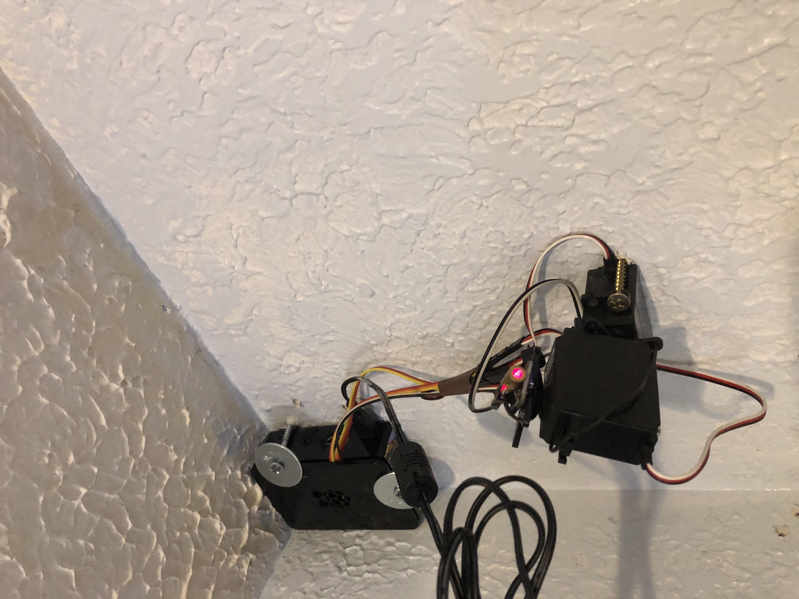

# Cat Attack

I slapped a laser on to two servos to create a distraction for my cat when he attacks my feet at night

{:height="50%" width="50%"}

Created a website to manually move the laser

Also create an endpoint to automatically move the laser in a specific way to distract the cat from my feet.
Which I then access with a voice command ("Cat Attack") to siri.

